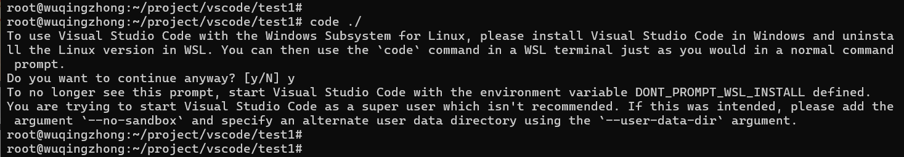

# Win11安装Ubuntu子系统
[Win11安装Ubuntu子系统](https://blog.csdn.net/Tim_Cookerr/article/details/127189008)


## 去微软应用下载
[微软应用商店](https://apps.microsoft.com/home?hl=zh-cn&gl=CN)
terminal 
ubuntu22.04.06
    下载 Ubuntu 22.04.5 LTS Installer.exe


## 更改镜像源
```

sudo sed -i "s@http://.*archive.ubuntu.com@https://mirrors.tuna.tsinghua.edu.cn@g" /etc/apt/sources.list
sudo sed -i "s@http://.*security.ubuntu.com@https://mirrors.tuna.tsinghua.edu.cn@g" /etc/apt/sources.list

sudo apt update
sudo apt upgrade 

```

### 其他镜像源 
```
[source.crates-io]
registry = "https://github.com/rust-lang/crates.io-index"

# 替换成你偏好的镜像源
replace-with = 'sjtu'

# 清华大学
[source.tuna]
registry = "https://mirrors.tuna.tsinghua.edu.cn/git/crates.io-index.git"

# 中国科学技术大学
[source.ustc]
registry = "git://mirrors.ustc.edu.cn/crates.io-index"

# 上海交通大学
[source.sjtu]
registry = "https://mirrors.sjtug.sjtu.edu.cn/git/crates.io-index"

# rustcc社区
[source.rustcc]
registry = "git://crates.rustcc.cn/crates.io-index"
```

## 如果将windows磁盘挂载在ubuntu上面
默认是挂载的在 /mnt/ 下面 

## windows ubuntu子系统能否克隆保存 
```
# 备份你的Ubuntu实例到tar文件
wsl --export Ubuntu-1001 /path/to/ubuntu.tar
wsl --export Ubuntu-22.04 D:\backup\Ubuntu-22.04.tar

# 卸载你的Ubuntu实例
wsl --unregister Ubuntu-1001
wsl --unregister Ubuntu-22.04
手动卸载呢？  # 不能手动卸载吗？


# 从tar文件导入Ubuntu实例
wsl --import Ubuntu-1001 /path/to/ubuntu-files /path/to/ubuntu.tar
wsl --import Ubuntu-22.04 D:\subsystem D:\backup\Ubuntu-22.04.tar

# 设置默认用户登录（如果在导出时没有设置默认用户）
ubuntu config --default-user username
wsl --shutdown
ubuntu2204.exe config --default-user wuqingzhong
```

## wsl安装多个同发行版本子系统 TODO
[wsl安装多个同发行版本子系统](https://www.junmajinlong.com/others/wsl_same_distro_versions/)
看样子是不推荐
[在wsl上安装多个相同版本的Ubuntu系统](https://blog.csdn.net/b1ue_2/article/details/131015828)


# 安装软件环境
## 安装c++ 编译开发环境
```
sudo apt install vim
sudo apt install cmake 
sudo apt intall sqlite3
# 图形化下载
sudo apt install sqlitebrowser
# 编译器
sudo apt-get install build-essentia
```

## ubuntu 环境下安装QT

```
https://blog.csdn.net/zvui_/article/details/108214959
sudo apt-get install build-essential
sudo apt-get install qtbase5-dev qtchooser qt5-qmake qtbase5-dev-tools
sudo apt-get install qtcreator  # 编辑软件
sudo apt-get install qt5*

# 怎么下载qt6
```

## 在使用 sqlite 时遇到的奇怪问题的正解
https://blog.csdn.net/m0_47505062/article/details/138044982
以前遇到的问题是test.db放在有权限限制的目录下， 权限被限制
图形软件自发在某个系统目录下复制该test.db， 
以后我们打开文件是， 默认用复制的的文件 // Note:因此产生一系列的问题

## ping 
ping -V 
[Ubuntu安装ping命令](https://blog.csdn.net/weixin_37787043/article/details/140989596) 
[Ubuntu 常用命令之 ping 命令用法介绍](https://blog.csdn.net/weixin_42148809/article/details/135107576)

ping -w 5 www.baidu.com

## ifconfig
sudo apt install net-tools


## 安装vscode 
发现不需要在子系统linux下安装vscode, 输入法等， ubuntu已经挂载的计算机所有的盘， 
我们在windows下编辑开发后， 然后在ubuntu下编译 （跨平台开发验证更简单， windwos和linux都能编译不需要代码拷贝来拷贝去）
这个方法适用于windwos和linux都有相同的库， 暂时就不用这种方法， 还是使用虚拟机+ubuntu22.04
这个方法， 用windows子系统ubuntu的还是有点不稳定  
以后还是要自己手动安装， 一键安装过于黑盒， 出错都不知道要改哪里

[Ubuntu 22.04安装vscode](https://blog.csdn.net/hai411741962/article/details/134573331)


出现错误


# 问题 
[ubuntu出现“http://ppa.launchpad.net/fcitx-team/nightly/ubuntu xenial Release“ 问题](https://blog.csdn.net/QilanAllen/article/details/103690927)


## vscode 汉化乱码 
[Win10内置Ubuntu子系统图形化界面安装&中文方块乱码解决](https://blog.csdn.net/qq_43543789/article/details/104211359)

安装搜狗输入法 // 暂时不用
[ubuntu22.04桌面版安装linux搜狗输入法](https://www.cnblogs.com/amsilence/p/18344774)
[安装指南](https://shurufa.sogou.com/linux/guide)


# shell命令使用
## 变量设置
export DONT_PROMPT_WSL_INSTALL=1
echo $DONT_PROMPT_WSL_INSTALL

## 删除除project目录下的所有文件目录
ls * | grep -v project | xargs rm -rf 
    没办法删除带双引号的文件和目录

## PATH 
$PATH下面有很多windwos下面的目录， 怎么删除掉 

## 支持正则表达式的命令
find
awk, sed, grep
sort, tr 
tr：字符转换和删除

基础 ls, pwd, echo, export
文件目录相关 mv cp touch mkdir rm 
进程相关 ps pkill 
网络相关的 netstat ping ifconfig

通过ipcs命令查看当前系统中的共享内存段：

