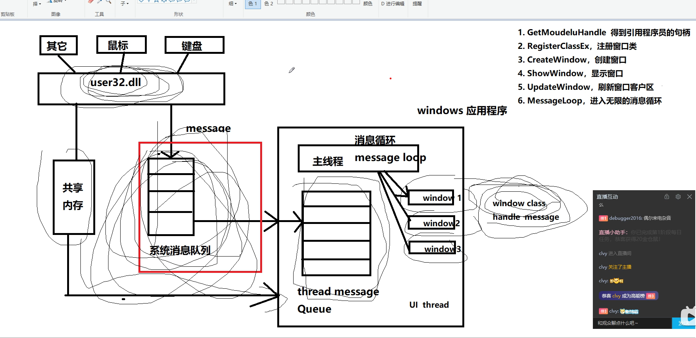

消息机制， 窗口机制， 用户管理机制， 多线程同步， 多进程通信 ，分析dump (windbg)

# 消息机制 
它是一种事件驱动的程序设计模式，主要是基于消息的
Windows中的消息机制基于消息队列和消息循环。每个GUI线程都会维护一个线程消息队列，应用程序通过消息循环不断从队列中提取消息并进行处理。

https://www.cnblogs.com/Zhaolongtao/p/18590158
通过这一机制，应用程序能够接收来自操作系统的各种事件和请求，并作出相应的响应和处理。

·消息队列。Windows能够为所有的应用程序维护一个消息队列。应用程序必须从消息队列中获取
消息，然后分派给某个窗口。
·消息循环。通过这个循环机制应用程序从消息队列中检索消息，再把它分派给适当的窗口，然
后继续从消息队列中检索下一条消息，再分派给适当的窗口，依次进行。
· 窗口过程。每个窗口都有一个窗口过程来接收传递给窗口的消息，它的任务就是获取消息然后
响应它。窗口过程是一个回调函数；处理了一个消息后，它通常要返回一个值给Windows。
注意回调函数是程序中的一种函数，它是由Windows或外部模块调用的。

## 消息的来源 
    操作系统产生的消息 
    用户触发事件消息 
    有消息产生消息 

消息常见的定义
    预定义消息  ： 
        普通窗口消息 wm 
        设备消息  ： dbt 
        按钮消息 ： bm 
        自定义消息 ： WM_USER + 1

消息的结构 
    窗口句柄 (windows是通过句柄来区分资源的)
    消息类型 
    高位参数
    低位参数
    时间 
    xy轴

sdk : 
    WinMain 
    msg结构体 
    注册窗口类 (系统发生消息给程序的可能?)
        先定义窗口类 （windProce ）
    创建窗口类 
    显示窗口
    刷新窗口
    消息循环 ： GetMessage, DispatchMessage 

eg。 
    键盘 --> user32.dll --> 系统消息队列（存储消息message）
        --> widows 应用程序  message queue （线程消息队列） --> 主线程 （ui message loop 消息循环）
            --> windows1, windows2... （不同的窗口）
                （不同的处理函数 回调函数winPro）

“句柄”---在Windows程序中，有各种各样的资源，系统在创建这些资源的时候，都会为他们分配内存，并返回标识这些资源的标识号，这个标识号就是句柄）

当鼠标、键盘事件被触发后，相应的鼠标或键盘驱动程序就会把这些事件转换成相应的消息，然后输送到系统消息队列，由 Windows系统去进行处理。

非队列消息将会绕过系统队列和消息队列，直接将消息发送到窗口过程，。系统发送非队列消息通知窗口，系统发送消息通知窗口。

### windows 为什么能从系统消息队列将消息传递给线程消息队列
eg. 点击的时候就是知道是那个窗口， 根据窗口找到对应的程序
Windows操作系统为每个线程维护一个消息队列，这个消息队列存在于内核中，对每个进程都是可见的，因此可以用于进程间通信。为了提升效率，操作系统并不会立即为每个线程创建消息队列，而是在调用PeekMessage/GetMessage时才创建消息队列。当用户操作（如鼠标点击、键盘输入）时，输入设备驱动器将输入转换为消息，并投放到系统消息队列中。Windows会从系统消息队列中移走一个消息，确定目的窗口，然后将该消息投递到创建目的窗口的线程消息队列中。线程消息队列接收该线程创建的所有窗口的鼠标和键盘消息，每个GUI线程从它的消息队列中移走消息并指导Windows系统将消息发送到相应窗口过程进行处理‌

## 为什么要注册窗口类 
每个窗口都是某个窗口类的实例。通过注册窗口类，可以确保创建的窗口具有一致的外观和行为，满足应用程序的需求‌
注册窗口类以后同一类窗口都用一套WindowProc。有统一的行为。
以后不用每个窗口都实现一次了。

## duilib的消息处理机制
    用的就是windows的消息处理机制
    https://blog.csdn.net/qq_44918090/article/details/131782644
    CPaintManagerUI类的MessageLoop

## qt的消息机制 事件机制 （在windows就是用消息处理机制）
    https://blog.csdn.net/qq_68245364/article/details/142404961
    https://www.cnblogs.com/Vancamel/p/11217973.html
    每一个Qt应用程序都对应一个唯一的 QApplication应用程序对象，然后调用这个对象的exec()函数

# 窗口机制
## 在窗口的创建之前为什么要进行注册？
    这些类型信息应在你创建前事先告诉Window系统。可以采用这种方法：就是我们事先写一份要创建窗口的类型申请表，提交（注册）给Window系统。然后在创建时，可以让Windows按这个申请表来创建你所要的窗口了。也就是说我们还应该先提交一个申请表，申请成功后再根据这个表创建一个窗口。   （创建窗口是系统创建的）
    https://blog.csdn.net/qq_43725310/article/details/126103608

# 用户管理机制
[Windows 用户管理操作介绍](https://blog.csdn.net/zk584715834/article/details/134643573)
多用户  -- 用户有不同的访问权限  
用户账户拥有唯一的安全标识符SID
最高级别的用户：system
默认系统管理员用户：Administrator
来宾用户：Guest

内核对象 --> 句柄 

# 多线程同步
[线程同步的几种方式](https://blog.csdn.net/Minotaur3/article/details/141432905)
互斥变量（Mutex）
    互斥量不仅可以在同一应用程序的不同线程之间实现资源的安全共享，还可以在不同应用程序的线程之间实现资源共享。
事件对象 （Event）    
资源信号量
临界区（Critical Section） ；比较像linux或者c++的互斥锁
    同一进程内的线程同步，特别是那些对性能要求较高且同步操作简单的场景。由于临界区的实现简单且速度快，适合用于控制数据访问的简单同步需求‌

## 事件

# 多进程通信 
共享内存， 管道， 信号, 信号量， 消息队列 （linux 下）
windows 有
    发送消息 WM_COPYDATA
    DLL共享段
    文件映射
    管道
## iocp 
    有名管道  c/s 模式

# 程序分析 
## 天网 verify   
    抓去测试程序信息， 出错，出报告.dat
    + dep -- xml (人可以看)

##   Procee Explore / Procee Minitor

## windbg调试 
[视频](https://www.bilibili.com/video/BV1UP411Q7fj?spm_id_from=333.788.videopod.sections&vd_source=8ea6dc6c02215b66383cf6ab9791e3b4)

类似 linux  GDB
dump 我经常用来静态分析 
动态直接用vs 工具 

查看函数调用堆栈
    [详情](https://www.cnblogs.com/lostin9772/p/18357632)
    kn      // 带栈编号显示当前调用堆栈
    lm  : load modules   // 列出所有模块对应的符号信息

# 注册表
不能跨平台，注册表数据库
不方便管理， 容易被篡改

产生背景 ： 使用ini文件，windows存储文件按块来， 有最小大小（eg.16KB)
    如果有个小文件只有（几个byte），这个文件也要占一块
    各个程序不好各自都起一个配置文件， 使用一个统一的注册表  

windows 提供一个同一的api来管理系统配置文件  （系统级同一注册表）
缺点 ： 没有注释， 可读性太差
    弥补 ： 组策略

linux 还是用去中心化的配置文件

# explore.exe 
  windows 资源管理器 
    : 任务栏， 。。。
   windows 管理软件的中枢
   管理Windows图形界面的重要进程，包括桌面、任务栏、文件资源管理器等
    出错， eg.蓝屏 
        查看注册表， 删除注册表里，可能导致卡死的程序 

# 后台程序 

PDBRipper安装
application verifier 应用程序验证程序